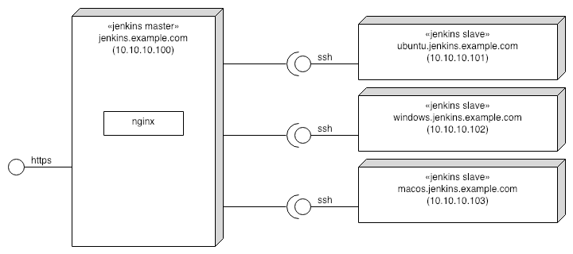

NOTE: This is a fork of [rgl/jenkins-vagrant](https://github.com/rgl/jenkins-vagrant), modified to not include gitlab or require custom vagrant boxes.

# Jenkins Vagrant

This is a [Vagrant](https://www.vagrantup.com/) Environment for a Continuous Integration server using the [Jenkins](https://jenkins.io) daemon. It includes support for all major operating systems (Mac, Windows, Linux).

## For the Non-Developer

Jenkins Vagrant is an easy way for projects to test, build, and deploy their code without the need of any 3rd party service.

## What is this?

This configures Jenkins through [CLI/JNLP](https://wiki.jenkins-ci.org/display/JENKINS/Jenkins+CLI) and [Groovy](http://www.groovy-lang.org/) scripts to:

* Enable the simple `Logged-in users can do anything` Authorization security policy.
* Add a SSH public key to `vagrant` user account and use it to access the CLI.
* Add and list users.
* Install and configure plugins.
* Setup nginx as a Jenkins HTTPS proxy and static file server.
* Create Freestyle project job.
* Create Pipeline job.
* Create Multibranch Pipeline job.
* Add a Ubuntu Linux slave node.
* Add a Windows slave node.
  * With enabled long path support on the OS and chocolatey.
* Add a macOS slave node.

**NB** If you are new to Groovy, be sure to check the [Groovy Learn X in Y minutes page](https://learnxinyminutes.com/docs/groovy/).

These are the machines and how they are connected with each other:




# Install

`virtualbox` and `vagrant` and `virtualbox-extension-pack` are the dependencies for this repository.
OSX users can get them via [brew](https://github.com/Homebrew/brew) and [brew cask](https://github.com/Homebrew/homebrew-cask):

## OSX Installations Instructions:

`brew cask install virtualbox`

`brew cask install vagrant`

`brew cask install virtualbox-extension-pack`

### Note about Virtualbox Installation:

Installing virtualbox requires you to allow `Oracle America, Inc` in `System Preferences > Security & Privacy` in order to finish the installation. More information can be found [here](http://osxdaily.com/2018/12/31/install-run-virtualbox-macos-install-kernel-fails/).

# Usage

Add the following entry to your `/etc/hosts` file:

```
10.10.10.100 jenkins.example.com
```

Run `vagrant up jenkins` to launch the master. See its output to learn how to login at the
[local Jenkins home page](https://jenkins.example.com) as `admin` (you can also login with
one of the example accounts, e.g. `alice.doe` and password `password`).

**NB** nginx is setup with a self-signed certificate that you have to trust before being able to access the local Jenkins home page.

Run `vagrant up ubuntu` to launch the Ubuntu slave.

Run `vagrant up windows` to launch the Windows slave.

Run `vagrant up macos` to launch the macOS slave.

# Reference

* [Jenkins Handbook](https://jenkins.io/doc/book/)
* [rgl/jenkins-vagrant](https://github.com/rgl/jenkins-vagrant)
