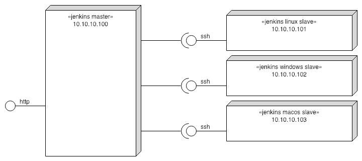

NOTE: This is a fork of [rgl/jenkins-vagrant](https://github.com/rgl/jenkins-vagrant), modified to not include gitlab or require custom vagrant boxes.

# Jenkins Vagrant

This is a [Vagrant](https://www.vagrantup.com/) Environment for a Continuous Integration server using the [Jenkins](https://jenkins.io) daemon. It includes support for all major operating systems (Mac, Windows, Linux).

## For the Non-Developer

Jenkins Vagrant is an easy way for projects to test, build, and deploy their code without the need of any 3rd party service.

## What is this?

This configures Jenkins through [CLI/JNLP](https://wiki.jenkins-ci.org/display/JENKINS/Jenkins+CLI) and [Groovy](http://www.groovy-lang.org/) scripts to:

* Enable the simple `Logged-in users can do anything` Authorization security policy.
* Add a SSH public key to `vagrant` user account and use it to access the CLI.
* Add and list users.
* Install and configure plugins.
* Create Freestyle project job.
* Create Pipeline job.
* Create Multibranch Pipeline job.
* Add a Ubuntu Linux slave node.
* Add a Windows slave node.
  * With enabled long path support on the OS and chocolatey.
* Add a macOS slave node.

If you are new to Groovy, be sure to check the [Groovy Learn X in Y minutes page](https://learnxinyminutes.com/docs/groovy/).

These are the machines and how they are connected with each other:




# Install

`virtualbox` and `vagrant` and `virtualbox-extension-pack` are the dependencies for this repository.
OSX users can get them via [brew](https://github.com/Homebrew/brew) and [brew cask](https://github.com/Homebrew/homebrew-cask):

## OSX Installations Instructions:

`brew cask install virtualbox`

`brew cask install vagrant`

`brew cask install virtualbox-extension-pack`

### Note about Virtualbox Installation:

Installing virtualbox requires you to allow `Oracle America, Inc` in `System Preferences > Security & Privacy` in order to finish the installation. More information can be found [here](http://osxdaily.com/2018/12/31/install-run-virtualbox-macos-install-kernel-fails/).


## Ubuntu Installation Instructions:

Virtualbox:

```
sudo apt-add-repository "deb http://download.virtualbox.org/virtualbox/debian $(lsb_release -sc) contrib"
wget -q https://www.virtualbox.org/download/oracle_vbox.asc -O- | sudo apt-key add -
sudo apt-get update
sudo apt-get install virtualbox -y
```

Vagrant:

```
wget https://releases.hashicorp.com/vagrant/2.2.3/vagrant_2.2.3_linux_amd64.zip
unzip vagrant_2.2.3_linux_amd64.zip
sudo mv vagrant /usr/local/bin/
```

Virtualbox Extension Pack:

```
LatestVirtualBoxVersion=$(wget -qO - http://download.virtualbox.org/virtualbox/LATEST-STABLE.TXT) && wget "http://download.virtualbox.org/virtualbox/${LatestVirtualBoxVersion}/Oracle_VM_VirtualBox_Extension_Pack-${LatestVirtualBoxVersion}.vbox-extpack"

sudo VBoxManage extpack install --replace Oracle_VM_VirtualBox_Extension_Pack-${LatestVirtualBoxVersion}.vbox-extpack
```
> https://unix.stackexchange.com/questions/289685/how-to-install-virtualbox-extension-pack-to-virtualbox-latest-version-on-linux/290462

# Usage

Run `vagrant up jenkins` to launch the master. See its output to learn how to login at the
Jenkins home page as `admin`.

Run `vagrant up ubuntu` to launch the Ubuntu slave.

Run `vagrant up windows` to launch the Windows slave.

Run `vagrant up macos` to launch the macOS slave.

# Reference

* [Jenkins Handbook](https://jenkins.io/doc/book/)
* [rgl/jenkins-vagrant](https://github.com/rgl/jenkins-vagrant)
